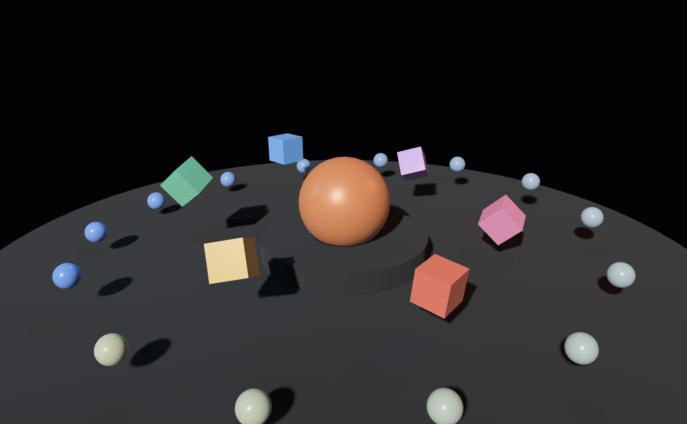
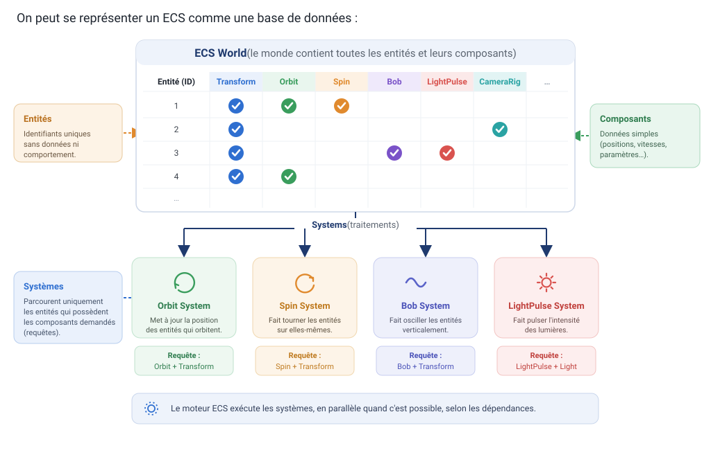
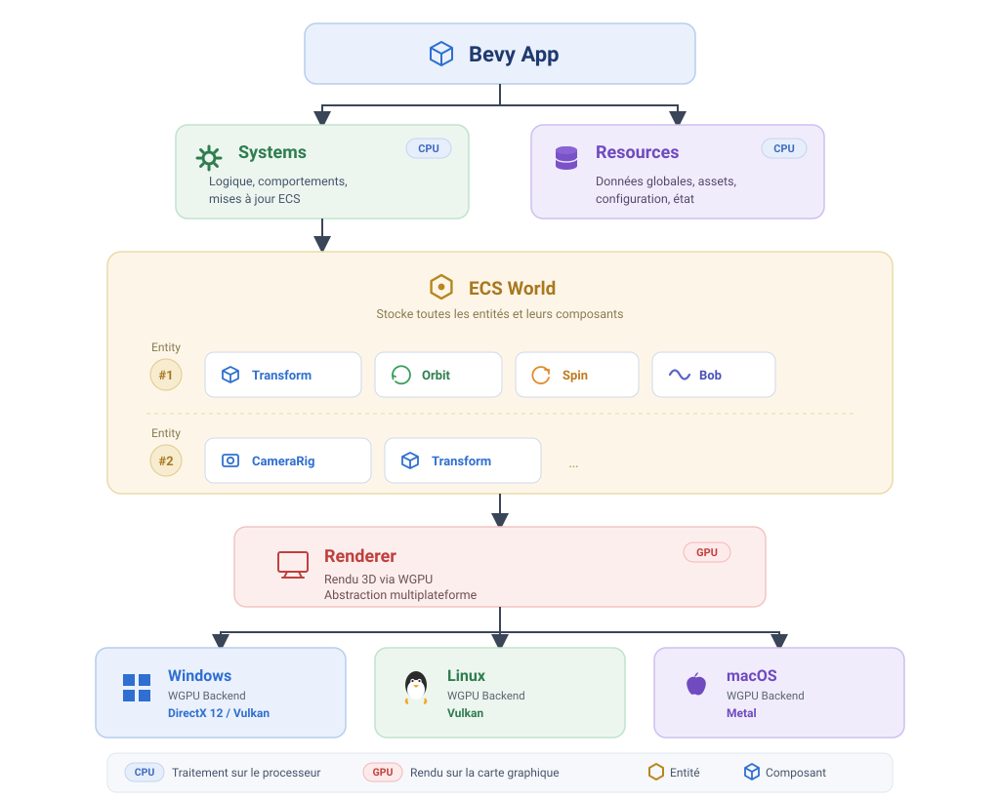

# ECS, animation 3D et Rust : comprendre Bevy en construisant une petite scène animée

> Code compagnon de l'article *« ECS, animation 3D et Rust : comprendre Bevy en construisant une petite scène animée »*, **_Programmez!_** hors-série n°23, 2026, pp. 30-35 ([lien](https://www.programmez.com/magazine/article/ecs-animation-3d-et-rust-comprendre-bevy-en-construisant-une-petite-scene-animee)).

Une petite scène 3D animée écrite en [Rust](https://www.rust-lang.org/) avec le moteur [Bevy](https://bevyengine.org/). L'objectif n'est pas le jeu en soi : l'article s'en sert comme **fil conducteur pour expliquer l'ECS** (Entity Component System). Plutôt que d'exposer l'ECS de façon théorique, il le construit **pas à pas à travers Bevy**, sur un exemple court et lisible de bout en bout — où chaque comportement visible à l'écran correspond à un **composant** (la donnée) et à un **système** (la logique qui agit sur les entités portant ce composant).

## Démonstration

https://github.com/user-attachments/assets/7c5e2151-3b76-44df-aa1a-89aed3388c88

[](media/ecs-bevy-demo.mp4)

> Vidéo : [`media/ecs-bevy-demo.mp4`](media/ecs-bevy-demo.mp4) · capture : [`media/ecs-bevy-demo.png`](media/ecs-bevy-demo.png)

## Ce que fait la démo

La scène met en mouvement plusieurs entités, chacune animée par un système qui ne « voit » que les entités portant le bon composant :

| Comportement à l'écran | Composant | Système |
| --- | --- | --- |
| Satellites en orbite autour du centre | `Orbit` | `animate_orbits` |
| Cubes qui tournent sur eux-mêmes | `Spin` | `animate_spins` |
| Objets qui oscillent de haut en bas | `Bob` | `animate_bob` |
| Lumières dont l'intensité pulse | `LightPulse` | `pulse_lights` |
| Caméra : cadrages multiples + zoom | `CameraRig` | `cycle_camera_shot`, `move_camera`, `zoom_camera` |

Le composant `Transform` (position / rotation / échelle) est partagé par presque toutes les entités : c'est lui que les systèmes d'animation combinent pour déplacer et orienter les objets. C'est précisément le propos de l'article : **voir l'ECS en action** plutôt que de le décrire de façon abstraite.

## Comprendre l'ECS en deux schémas

### L'ECS, comme une base de données

Les **entités** sont de simples identifiants, les **composants** sont les données qui leur sont attachées, et les **systèmes** ne parcourent que les entités possédant les composants qu'ils demandent (les requêtes).



### L'architecture d'une application Bevy

L'`App` orchestre les **systems** (CPU) et les **resources** (CPU) ; l'**ECS World** stocke entités et composants ; le **renderer** (GPU) s'appuie sur WGPU pour cibler Windows, Linux et macOS.



## Lancer la démo

```bash
cargo run
```

**Contrôles :** clic droit maintenu → changer de vue · molette → zoom.

## Structure

```
src/
├── main.rs         # App Bevy : fenêtre, ordonnancement des systèmes
├── components.rs   # Composants (Orbit, Spin, Bob, LightPulse, CameraRig…)
├── scene.rs        # Construction de la scène (entités + composants)
└── systems.rs      # Systèmes : orbites, rotations, oscillations, lumières, caméra
```
